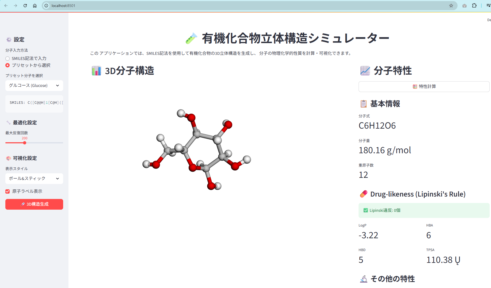
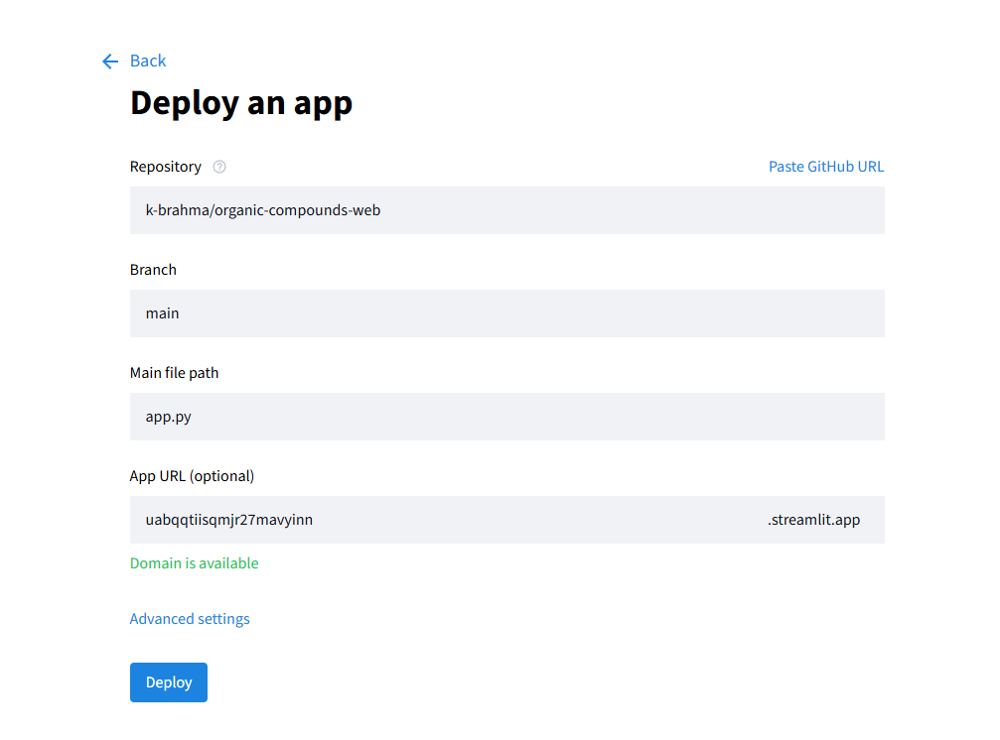

# Organic Compounds 3D Structure Simulator

化学構造式から3D分子モデルを生成・可視化するWebアプリケーションです。

[](https://share.streamlit.io/)

## 機能

- SMILES記法による分子構造入力
- 3D分子モデルの自動生成
- インタラクティブな3D表示（回転・ズーム可能）
- 分子情報の表示（分子量、組成式、原子数など）

## デモ



## 簡単デプロイ方法

### 方法1：Streamlit Cloud（推奨 - コード知識不要！）

1. このリポジトリをFork
2. [Streamlit Cloud](https://share.streamlit.io/)にアクセス
3. GitHubアカウントでログイン
4. 「Create app」をクリック
5. Forkしたリポジトリを選択
6. 「Deploy!」をクリック



**たった5分でWebアプリが公開できます！**

### 方法2：GitHub Codespaces（開発環境として）

1. リポジトリページで「Code」→「Codespaces」→「Create codespace」
2. ターミナルで：
   ```bash
   pip install -r requirements.txt
   streamlit run app.py
   ```
3. ポート転送で外部アクセス可能

### 方法3：ローカル環境

```bash
# リポジトリをクローン
git clone https://github.com/[your-username]/organic-compounds-web.git
cd organic-compounds-web

# 依存関係をインストール
pip install -r requirements.txt

# アプリを起動
streamlit run app.py
```

## 使い方

1. SMILES記法で分子構造を入力
   - 例：`CC(C)CC(C)(C)O` （テルピネオール）
   - 例：`CCO` （エタノール）
   - 例：`c1ccccc1` （ベンゼン）

2. 「Generate 3D Structure」ボタンをクリック

3. 生成された3D分子モデルを操作
   - マウスドラッグで回転
   - スクロールでズーム
   - 右クリックドラッグで移動

## サンプル分子

| 分子名 | SMILES |
|--------|--------|
| エタノール | `CCO` |
| ベンゼン | `c1ccccc1` |
| カフェイン | `CN1C=NC2=C1C(=O)N(C(=O)N2C)C` |
| アスピリン | `CC(=O)OC1=CC=CC=C1C(=O)O` |
| グルコース | `C(C1C(C(C(C(O1)O)O)O)O)O` |

## 技術スタック

- **Frontend**: Streamlit
- **3D Visualization**: Py3Dmol
- **Chemistry**: RDKit
- **Python**: 3.8+

## 必要環境

- Python 3.8以上
- 依存パッケージは`requirements.txt`参照

## ライセンス

MIT License です。改変再配布ご自由にどうぞ。

## 作者

Keiichi Ogawa

## 貢献

プルリクエストを歓迎します！

1. このリポジトリをFork
2. 機能ブランチを作成 (`git checkout -b feature/AmazingFeature`)
3. 変更をコミット (`git commit -m 'Add some AmazingFeature'`)
4. ブランチをPush (`git push origin feature/AmazingFeature`)
5. プルリクエストを作成

## サポート

問題や質問がある場合は、[Issues](https://github.com/k-brahma/organic-compounds-web/issues)でお知らせください。

---

**IT初心者の方へ**: Streamlit Cloudを使えば、プログラミング知識がなくても簡単にこのアプリを公開できます！上記の「簡単デプロイ方法」を参照してください。